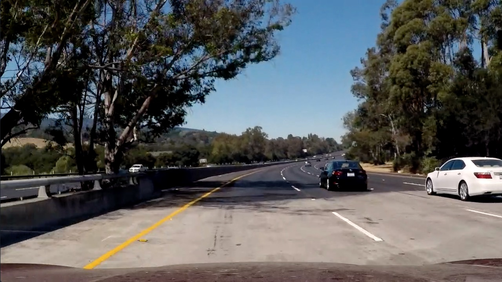

**Advanced Lane Finding Project**
---

***Running the code***
The environment needed to run this code can be found [here](./lane-lines.yml). The code can be run using the following command:

`python src/main/python/Main.py`

The code assumes that you have camera calibration images in a folder named `camera_cal`.

Overall steps of this project are the following:

* Compute the camera calibration matrix and distortion coefficients given a set of chessboard images.
* Apply a distortion correction to raw images.
* Use color transforms, gradients, etc., to create a thresholded binary image.
* Apply a perspective transform to rectify binary image ("birds-eye view").
* Detect lane pixels and fit to find the lane boundary.
* Determine the curvature of the lane and vehicle position with respect to center.
* Warp the detected lane boundaries back onto the original image.
* Output visual display of the lane boundaries and numerical estimation of lane curvature and vehicle position.

---

###Camera Calibration

####1. Camera matrix and distortion coefficients
The code for this step is contained in the file [CameraCalibration.py](./src/main/python/transforms/CameraCalibration.py). Camera calibration involves reading chessboard images taken from the camera. We start with setting "object points" which are (x, y, z) coordinates of the chessboard corners in the world. In these images we assume z = 0, implying the chessboard is lying flat on x-y plane. These points stay the same for all calibration images, so we just replicate them for each image. We use OpenCV to get "image
points" which are the actual coordinates of chessboard corners in the image. If we are able to successfully find these, we append both the object and image points to a list. This is done [here](./src/main/python/transforms/CameraCalibration.py#L24:L37).

Once we have the set of points from various images, we then compute camera calibration and distortion coefficients using `cv2.calibrateCamera()`. I store the distortion coefficients for use in the processing pipeline later. I do this [here](./src/main/python/transforms/CameraCalibration.py#L43).

Original image</img>

Undistorted image</img>

###Pipeline (single images)

####1. Distortion-corrected image.
The following images show application of distortion-correction to an input image.

Original image</img>
Undistorted image</img>

####2. Color transforms and gradients to create a thresholded image.
I used a combination of BGR to HLS color transformation and Sobel gradient thresholds to generate a binary image. [The code](./src/main/python/transforms/Thresholding.py#L15:L43) shows the transformation. Any pixel that is set in Sobel X transformed image or the S channel of the HLS transformed image is set to 1. This becomes the thresholded image. An example:

Thresholded image</img>
