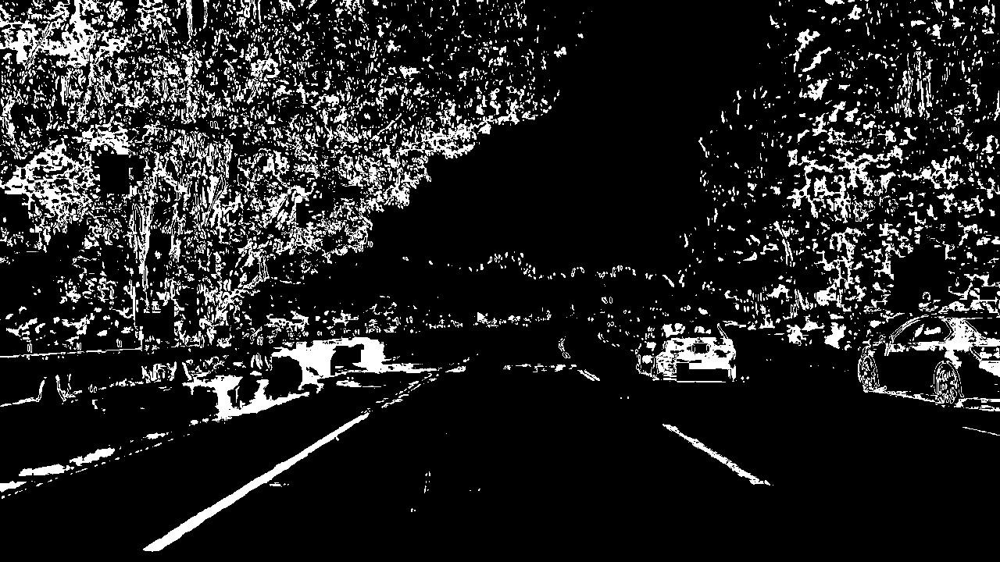

**Advanced Lane Finding Project**
---

***Running the code***

The environment needed to run this code can be found [here](./lane-lines.yml). The code can be run using the following command:

`python src/main/python/Main.py`

The code assumes that you have camera calibration images in a folder named `camera_cal`.

---

Overall steps of this project are the following:

* Compute the camera calibration matrix and distortion coefficients given a set of chessboard images.
* Apply a distortion correction to raw images.
* Use color transforms, gradients, etc., to create a thresholded binary image.
* Apply a perspective transform to rectify binary image ("birds-eye view").
* Detect lane pixels and fit to find the lane boundary.
* Determine the curvature of the lane and vehicle position with respect to center.
* Warp the detected lane boundaries back onto the original image.
* Output visual display of the lane boundaries and numerical estimation of lane curvature and vehicle position.

---

###Camera Calibration

####1. Camera matrix and distortion coefficients
The code for this step is contained in the file [CameraCalibration.py](./src/main/python/transforms/CameraCalibration.py). Camera calibration involves reading chessboard images taken from the camera. We start with setting "object points" which are (x, y, z) coordinates of the chessboard corners in the world. In these images we assume z = 0, implying the chessboard is lying flat on x-y plane. These points stay the same for all calibration images, so we just replicate them for each image. We use OpenCV to get "image
points" which are the actual coordinates of chessboard corners in the image. If we are able to successfully find these, we append both the object and image points to a list. This is done [here](./src/main/python/transforms/CameraCalibration.py#L24:L37).

Once we have the set of points from various images, we then compute camera calibration and distortion coefficients using `cv2.calibrateCamera()`. I store the distortion coefficients for use in the processing pipeline later. I do this [here](./src/main/python/transforms/CameraCalibration.py#L43).

Original image</img>

Undistorted image</img>

###Pipeline (single images)

####1. Distortion-corrected image.
The following images show application of distortion-correction to an input image.

Original image</img>
Undistorted image</img>

####2. Color transforms and gradients to create a thresholded image.
I used a combination of BGR to HLS color transformation and Sobel gradient thresholds to generate a binary image. [The code](./src/main/python/transforms/Thresholding.py#L15:L43) shows the transformation. Any pixel that is set in Sobel X transformed image or the S channel of the HLS transformed image is set to 1. This becomes the thresholded image. An example:

Thresholded image</img>

Note that the lane lines are very clearly visible.

####3. Perspective transformation
Perspective transformation converts the image to a "bird's eye" perspective of the road ahead. This makes the lane lines parallel. The transformation involves choosing a quadrilateral in a source image and specifying where the corners should lie in the destination image. This is done in the code [here](./src/main/python/transforms/PerspectiveTransform.py#L14:L16).

The images look like the following:

Original</img>
Perspective transformed</img>

Note that the red quadrilateral covers the lane and the lane lines look parallel in the transformed image. The same transformation on the thresholded image looks like the following:

Perspective transformed</img>

####4. Identifying lane line pixels and polynomial fit
Once we have a transformed thresholded image, we can use it for identifying the lane pixels. We start by identifying the regions with highest density of pixels in the thresholded image. This is done by getting a histogram of the bottom half of the image. This is shown in the code [here](./src/main/python/LineSearch/WindowSearch.py#L25:L32). Once this is done, we roughly know the `x` dimension of both the left and right lanes. We use this as the center and create rectangular windows of suitable margin around the center and suitable height. Here we choose to make 9 windows, that makes the height of each window (720/9 = 80 pixels). We take a margin of 100 pixels on either side of the center we found earlier. 

For each window, we find the number of points available in both the lanes. This is in the code [here](./src/main/python/LineSearch/WindowSearch.py#L40:L66). If we find a suitable number of points in the window, we move the center of the next window to the average `x` of the pixels from the previous window. We keep a track of all the points we find this way. Once we have completed the search, we use these points and fit a 2nd degree polynomial. The fitted polynomial can be used to detect the radius of curvature of the road and also find the distance between the lane lines. The is done in the code [here](./src/main/python/LineSearch/WindowSearch.py#L133:L140)

The next time we want to search the next image, given that the images will likely be similar, we only need to search around the lines we fit in the previous image. These lines and the search area look like the following:

Search space</img>

This strategy is implemented [here](./src/main/python/LineSearch/WindowSearch.py#L88:L110)

Since these are heuristics being used here, the lane detection can often wander all over the place depending on the brightness levels in the original image, the color of the road, the visibility of the lane lines, turns and such. To stabilize this, we employ several strategies. 

#####1. Sanity checks
We sanity check each fit we get. We predominatly check of the fit used a decent number of points. Higher the points, chances are we got a good detection, and therefore a good fit. We also check if the lane width we are detecting makes sense. The lane width should be around 3.7m, given the errors in detection, we give it a small margin, and check for the width to be between 3.3m and 4m. All this is done in the code [here](./src/main/python/LineSearch/WindowSearch.py#L142:L161).

#####2. Averaging polynomial fit
Once a polynomial fit passes the sanity check, we update our best fit with it. We do a weighted average over the previous average fit and the new fit. This results in a kind of exponential decay of older fits, which should fade away from the fit. This is done in the code [here](./src/main/python/LineSearch/Line.py#L47:L48).

####5. Radius of Curvature and lane width calculation
The radius of curvature is evaluated [here](./src/main/python/LineSearch/Line.py#L69:L78). It used this [formula](https://en.wikipedia.org/wiki/Radius_of_curvature#Formula). The key thing to note here is that the polynomial fits are in the pixel domain, so using this formula on the polynomial fit would give us the radius in pixels. To convert this, we need calibration from pixel domain to real world. From the images, we can tell the lane width in pixels and use that to get a measure of the number of pixels/m in `x`. Similarly, we can look at the number of pixels in broken white lines to get an estimate of the `y` dimension pixels/m. These are found to be 3.7/700 m/pixels in `x` and 30/720 m/pixels in `y`. These are used to evaluate the ROC and lane-width in meters.

We can also evaluate the mid-point between the lanes and use that to evaluate the deviation of the car from the middle of the lane. This is evaluated [here](./src/main/python/LineSearch/WindowSearch.py#L133:L140).

####6. Putting it all together
Once we get the lane, we apply appropriate mask on it like shown [here](./src/main/python/Main.py#L32:L41). We _inverse_ transform this image and then add it to the undistorted image like shown [here](./src/main/python/Main.py#L45:L49). The final image looks like the following:

### Final video
The final output video looks like [this](./project_video_output.mp4).

### Conclusion
We used several computer vision techniques to come up with heuristics that can help us detect lanes with a fair degree of accuracy. All these heuristics are dependent on the brightness levels in the original image, the color of the road, the visibility of the lane lines, turns and such. Experimenting with the _challenge_ video and the _harder_challenge_ video shows some more realistic driving conditions where the roads are not freshly paved, so the lane markers are faded, and become hard to distinguish from the color of the road, specially in bright and sunny conditions, or there are constant shadows and places where the turns are so sharp the lane marker doesn't come into the view of the camera. 

Some of these challenges can likely be solved with coming up with a bunch of different thresholding, transformation and other configurations that work well under different and more challenging conditions. Lane detection can also likely be improved by using Hough transformation.

Averaging and keeping a track of previous fits is a strategy that can be fine tuned as well, and can play a significant role on stabilizing some of the polynomial fit fluctuations. It can also likely stabilize the radius of curvature measurements. A better strategy would be to consider each lane individually when sanity checking as well, so we don't drop good fits on a lane if the other lane has a bad fit.

The computer vision techniques used here do have promise and can be used to improve this pipeline significantly.
